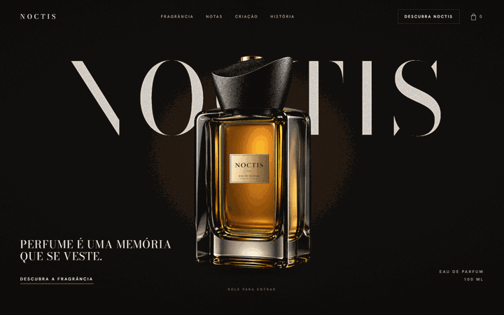
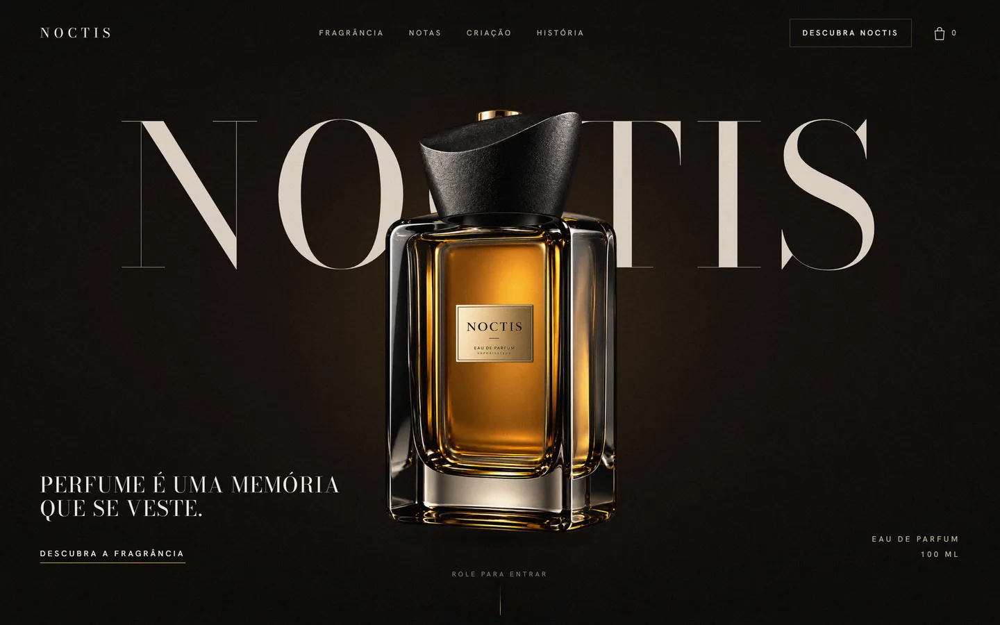
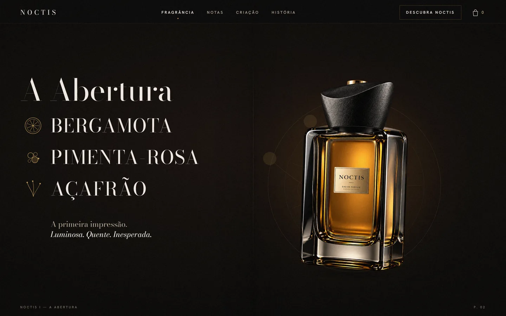
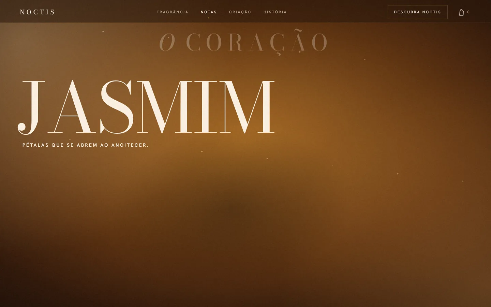
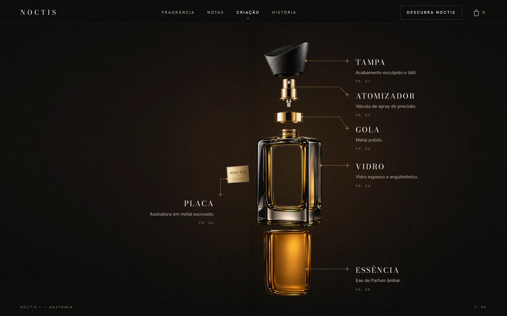
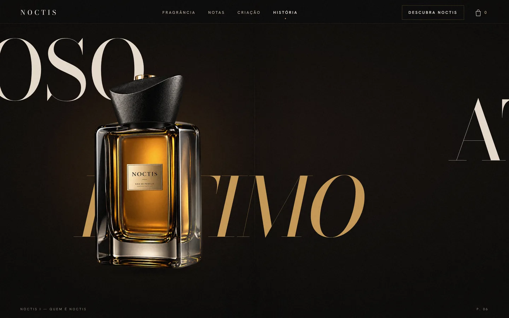
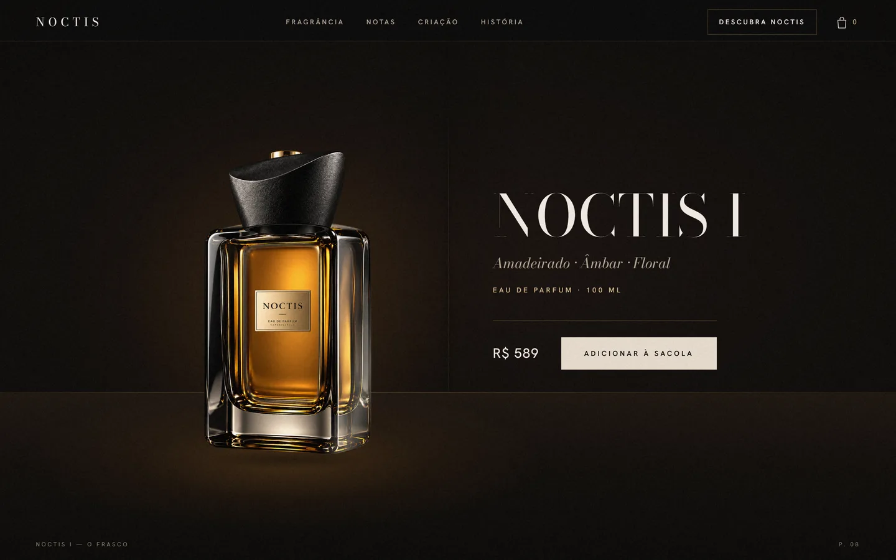
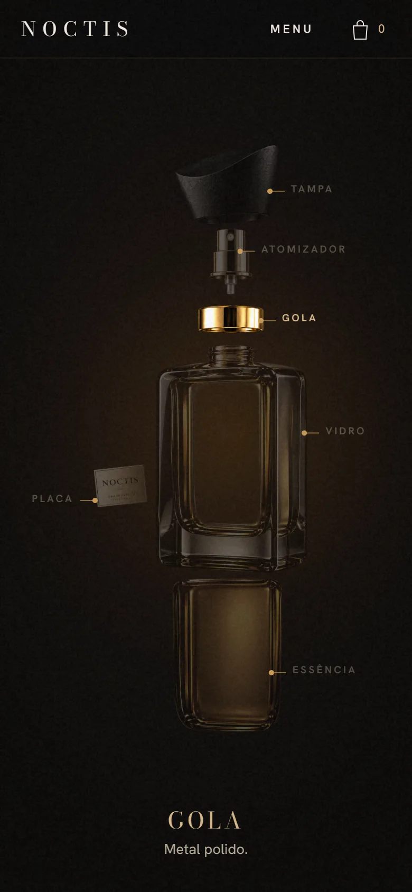
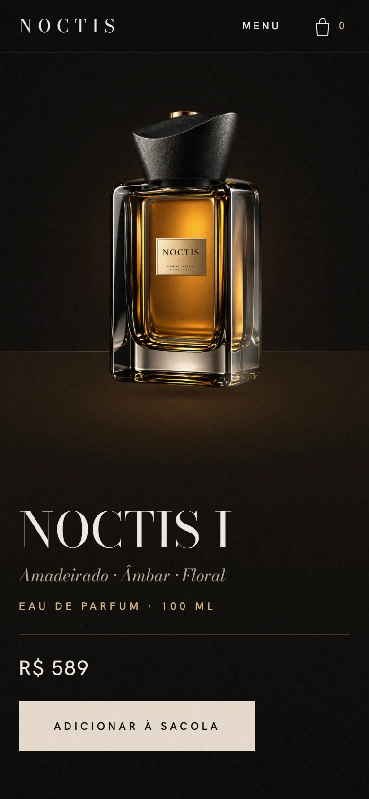

<div align="center">

# NOCTIS

**Campanha digital de um perfume, controlada pelo scroll.**
Um único frasco atravessa a página inteira: abre as notas, mergulha no líquido,
se desmonta em vista explodida, se remonta e pousa no produto — **sem 3D**.

### 🔗 [Ver o site ao vivo](https://noctis-perfume.vercel.app)

[](https://noctis-perfume.vercel.app)



</div>

---

## O desafio

O material de partida eram **seis imagens soltas** do frasco — tampa, atomizador, gola, corpo de vidro,
líquido e placa — geradas separadamente, com enquadramentos, escalas e áreas transparentes diferentes.
Não existia nenhuma imagem do **frasco montado** para servir de referência.

O pedido era um site que parecesse campanha de marca de luxo, com o perfume como personagem principal,
e uma restrição dura: **nada de Three.js, WebGL ou modelos 3D**. Toda a profundidade teria que vir de
camadas 2D, transform, máscara e luz falsa.

## A solução

**1. Montar o frasco por medição, não por tentativa.**
Como não havia render do conjunto, as proporções foram extraídas da vista explodida de referência
(largura do gargalo, do flange, da gola e da tampa) e os encaixes calculados a partir do perfil de
transparência de cada PNG. Duas descobertas definiram o resultado: o corpo tem uma **janela
transparente** (o líquido precisa ficar atrás do vidro) e a tampa foi renderizada **vista de baixo**,
o que a fazia flutuar — corrigido com um deslocamento medido de 45 unidades.

A calibração final vive em **um único arquivo** (`src/config/perfumeAssemblyConfig.ts`): posição,
escala, rotação, z-index e origem de cada peça. O mesmo arquivo alimenta o site e um script que
recompõe o frasco com `sharp`, o que permitiu validar o alinhamento **por diferença de pixels**
entre o CSS e o render de referência.

**2. Uma timeline só.**
A história inteira é uma linha do tempo GSAP com `scrub`, medida em "vh de scroll". O frasco nunca é
duplicado: é o mesmo objeto que se move, escala, passa atrás e na frente da tipografia, se desmonta e
se remonta. Clone existe só no voo do "Adicionar à sacola".

**3. Profundidade sem 3D.**
A cena é um único contexto de empilhamento com ordem fixa: halo, superfície, palavras atrás, glifos,
**frasco**, texto na frente, anotações, interior âmbar, reveal. Palavras gigantes existem em duas
cópias — a da frente recortada no eixo do frasco —, então a palavra some atrás do vidro de um lado e
passa por cima dele do outro.

## Resultado

| | |
|---|---|
| **Desempenho** | mediana de 13 ms por quadro; pior quadro de 13,7 ms na maior parte da narrativa |
| **Qualidade** | 28 verificações automatizadas em navegador headless, sem erros de console |
| **Acessibilidade** | versão estática completa para `prefers-reduced-motion`, navegação por teclado, foco visível, nada dependente de hover |
| **Peso** | 231 KB de JS (gzip) e 1 MB de imagens para a experiência inteira |

---

## A narrativa

| | |
|---|---|
|  |  |
| **Hero** — o nome atrás do frasco, com o "C" escondido pelo vidro | **A Abertura** — notas de saída; os glifos saem de trás do frasco |
|  |  |
| **O Coração** — a câmera entra no líquido e o mundo vira âmbar | **Anatomia** — seis peças separadas, com anotações editoriais |
|  |  |
| **Quem é NOCTIS** — a palavra atravessa o frasco | **O Frasco** — pouso, preço e sacola funcionando |

<div align="center">

  

*No celular a composição é própria, não uma versão encolhida do desktop.*

</div>

---

## ▶ Como baixar e rodar o site em outro computador (sem terminal, Windows)

> Este repositório é o **código do site**. Para ver o site funcionando, é preciso **baixar** a pasta
> e **rodar** no computador. São 3 passos, só com cliques:

**1. Baixar o projeto**
- **GitHub Desktop** (recomendado): *File → Clone repository* → escolha `noctis-perfume` → **Clone**.
  Para receber atualizações depois, clique em **Fetch origin / Pull origin**.
- **Ou pelo site do GitHub:** botão verde **Code → Download ZIP** e extraia a pasta.

**2. Instalar o Node.js (só uma vez por computador)**
- Baixe a versão **LTS** em <https://nodejs.org/pt-br/download> e instale clicando em *Avançar*.

**3. Rodar**
- Abra a pasta do projeto e dê **dois cliques em `iniciar-site.bat`**.
- Na primeira vez ele instala o que precisa (alguns minutos); depois o navegador abre sozinho em
  **http://localhost:3000**.
- **Deixe a janela preta aberta** enquanto usa o site. Para desligar, é só fechá-la.

Se o Node.js não estiver instalado, o próprio `iniciar-site.bat` avisa e abre a página de download.

## Rodar pelo terminal (desenvolvimento)

```bash
npm install
npm run dev            # http://localhost:3000, recarrega ao editar
npm run build && npm start
```

Requer Node.js 20.9 ou mais novo.

**Stack:** Next.js 16 · React 19 · TypeScript · Tailwind CSS 4 · GSAP 3.15 (ScrollTrigger, CustomEase, SplitText, EasePack)

---

## Estrutura

```
src/
  app/                    layout (fontes, preload), page, globals.css (tokens + frasco), scene.css (cena)
  config/
    perfumeAssets.generated.ts   dimensões naturais das peças (gerado)
    perfumeAssemblyConfig.ts     CALIBRAÇÃO do frasco: x, y, scale, rotation, zIndex, origem, opacidade
                                 + deslocamentos da vista explodida (desktop e compacto)
    storyConfig.ts               ROTEIRO: intervalos da timeline (em vh de scroll) e poses por layout
    siteConfig.ts                textos, produto, notas, peças
  components/
    noctis/      PerfumeAssembly, PerfumeLayer, PerfumeHighlight, PerfumeDebug
    motion/      NoctisStory (cena + interações), buildTimeline (timeline mestre)
    sections/    Hero, OpeningNotes, InsideNoctis, CraftSection, PersonalitySection, FeelReveal, ProductSection, Footer
    cart/        CartProvider (estado + localStorage), CartDrawer (<dialog> nativo)
    ui/          Navbar (com menu de telas estreitas), Preloader
    Experience.tsx   orquestra preloader → história, voo do ADD TO BAG
    ReducedStory.tsx versão estática para prefers-reduced-motion
  hooks/usePrefersReducedMotion.ts
scripts/
  process-assets.mjs     recorta os PNGs-fonte pelo alfa e gera WebP + manifesto
  compose-assembly.mts   renderiza o frasco a partir do config (gabarito e noctis-full.webp)
  make-textures.mjs      grão e seda âmbar (sintéticos)
  make-showcase.mjs      imagens e GIF deste README
  record-reel.mjs        vídeo vertical da narrativa
  qa-shoot / qa-sheet / qa-interactions / qa-perf / qa-verdict   QA em navegador headless
assets/source/           renders originais (raw) e recortados (trimmed, gerado) — fora de /public
docs/                    imagens, GIF e vídeo de divulgação
```

## Os assets

Os anexos originais foram classificados visualmente (duplicatas eliminadas por hash) e organizados em
`public/images/noctis/`. Cada arquivo carrega sua **procedência** registrada ao lado (origem ou prompt
de geração). A textura do reveal e o grão são **sintéticos**, gerados por código em
`scripts/make-textures.mjs`.

## Calibrar o frasco

1. `npm run dev` e abra `/?debugPerfume=true` (não existe em produção).
2. O painel mostra caixas, centros, z-index, posição e escala de cada camada, com sobreposição do
   render de referência e alternância montado / explodido / compacto.
3. Edite `src/config/perfumeAssemblyConfig.ts`. Para regenerar o gabarito:
   `node scripts/compose-assembly.mts --out ref.png` (ou `--exploded --debug`) e `--full` para `noctis-full.webp`.

## Ajustar a narrativa

Tudo é **uma** timeline com scrub (`buildTimeline.ts`); a unidade é "vh de scroll". Mover um momento
é mudar um intervalo em `STORY`; mudar enquadramento é editar `POSES[desktop|tablet|mobile]`.
Layouts: desktop ≥ 1024px, tablet 700–1023px, mobile < 700px (mesmos limites no CSS).

## QA

```bash
node scripts/qa-interactions.mjs out/int http://localhost:3221/   # 28 verificações
node scripts/qa-shoot.mjs out/1440 1440x900 http://localhost:3221/
node scripts/qa-perf.mjs http://localhost:3221/ 1440x900
```

## Sobre a marca

NOCTIS é uma **casa fictícia**, criada como peça de portfólio. Links sociais são `#`, o checkout é
demonstrativo e as imagens do frasco vieram de geração por IA — para um cliente real, seriam
substituídas por fotografia do produto. O sistema aceita a troca sem reescrever a narrativa.

Documentação de design: [`DESIGN.md`](DESIGN.md) · Contexto de produto: [`PRODUCT.md`](PRODUCT.md)
